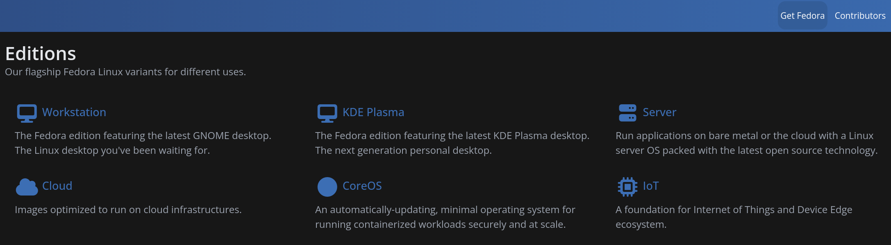
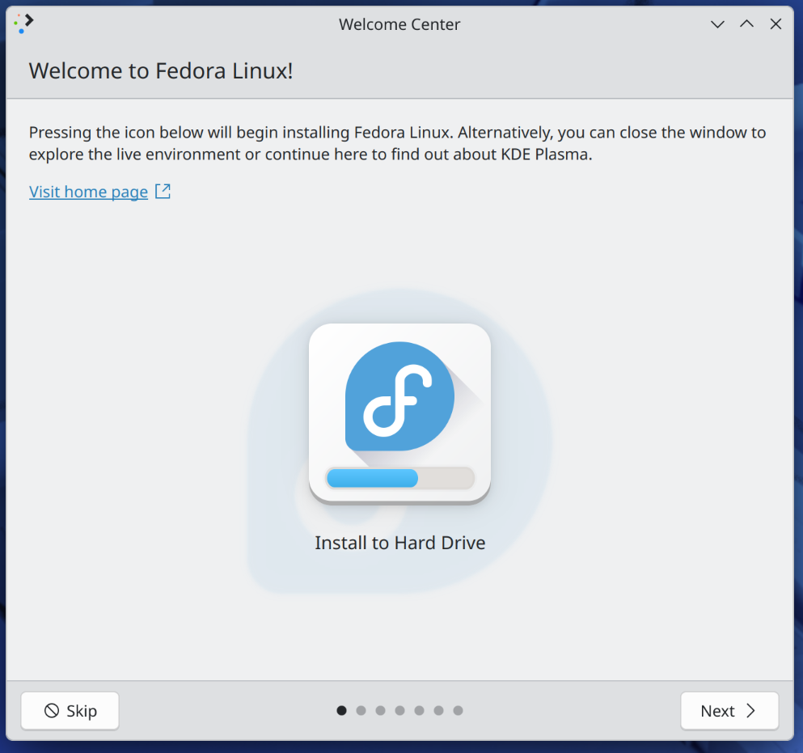
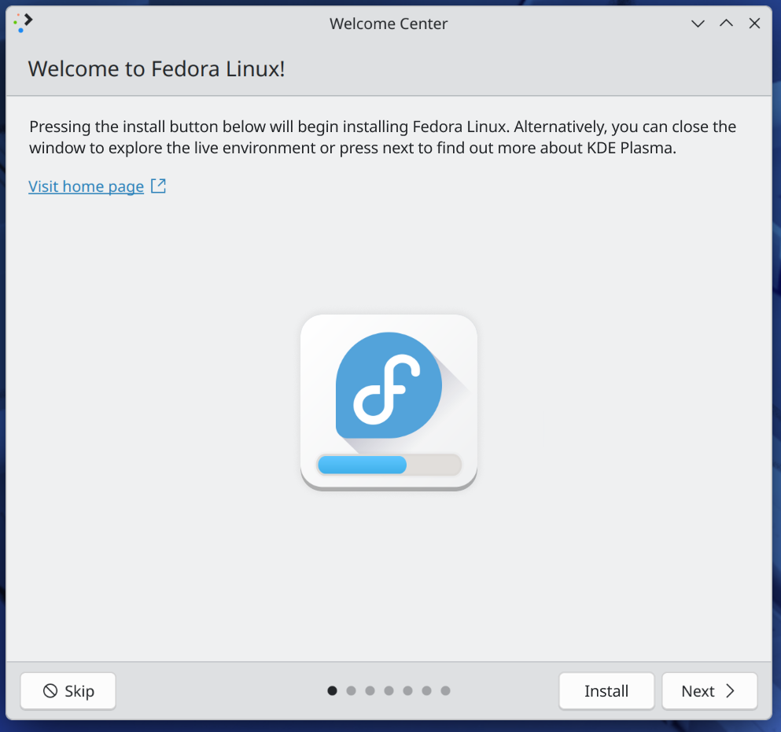
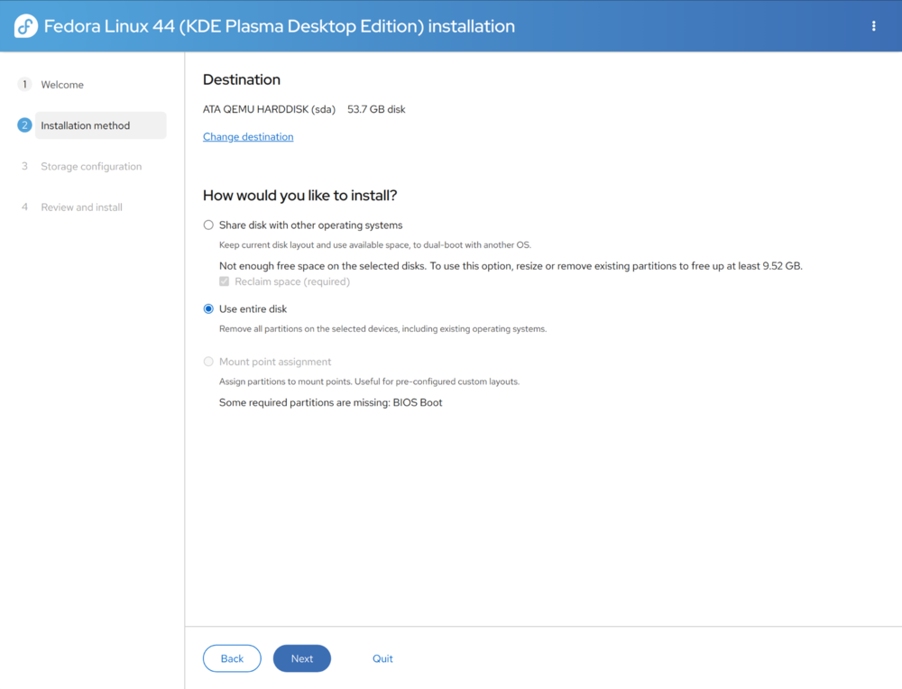
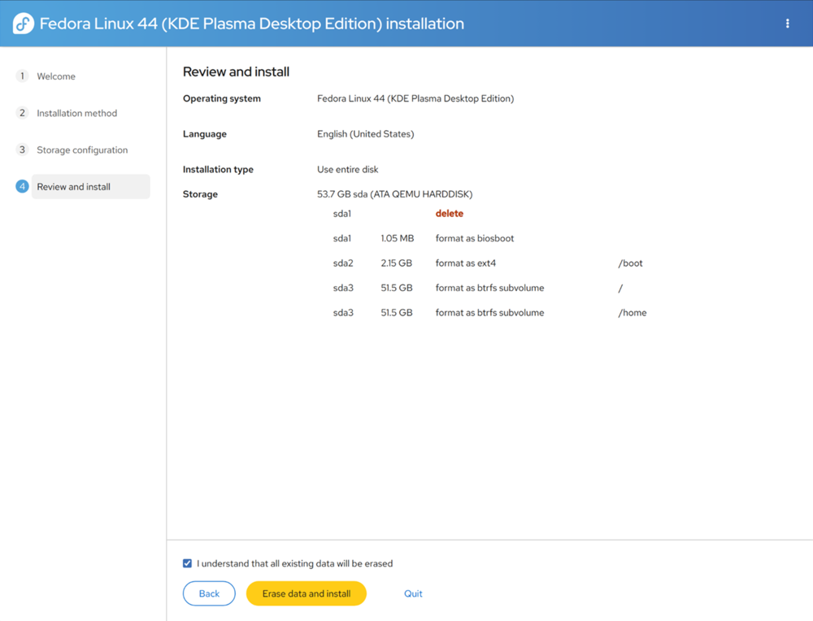
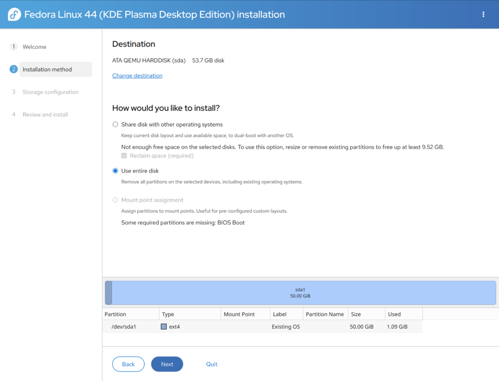
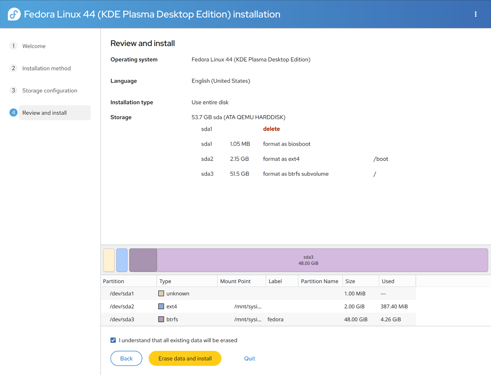
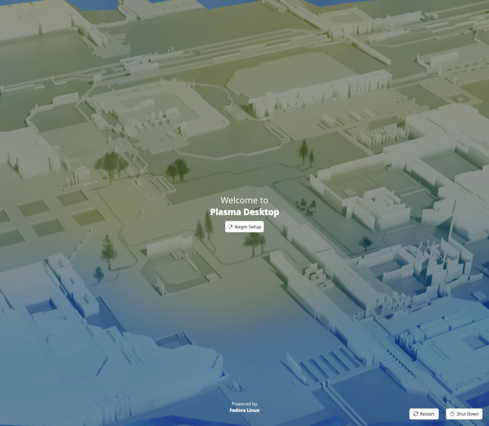
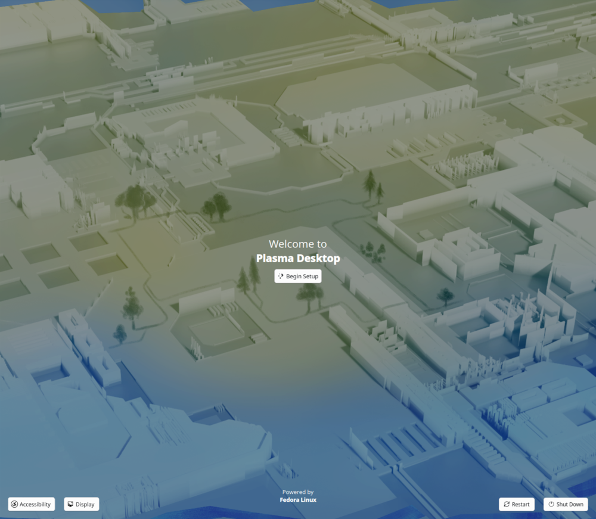

# As Windows continues down the path of enslopification, has the year of the Linux desktop finally arrived?
## Preface
### A new wave of interest
It's no secret that the Windows ecosystem has been in a continuous backslide in terms of quality since the release of Windows 8 (or Vista depending on who you ask). This is a trend that started long before the move to AI, primarily driven by Microsoft's monopoly when it comes to general desktop computing. With [up to 30% of new code](https://www.cnbc.com/2025/04/29/satya-nadella-says-as-much-as-30percent-of-microsoft-code-is-written-by-ai.html) added to Windows being written by AI, this decay seems to have only accelerated, user dissatisfaction has even reach the point that it's been [acknowledged by Microsoft](https://www.windowscentral.com/microsoft/windows-11/windows-11-major-improvements-announced-movable-taskbar-less-ads-reduced-copilot-better-performance-2026).

While many tech-savvy Windows users show interest in moving over to Linux, until recently nothing has really pushed them to make the jump. \
However, with the end of support for Windows 10, there's been an [uptick in discussion](https://www.reddit.com/r/linuxquestions/comments/1j7h6vk/can_i_get_some_of_you_guys_pros_cons_from/) from people who have made that switch, or are looking to do so. While there are many people who are incredibly happy to leave Windows behind, a not insignificant amount also end up running into issues with Linux and [switch back](https://www.reddit.com/r/linux_gaming/comments/1rvdmqz/i_regrettably_switched_back_to_windows/) to Windows.

Even for those that do stick with Linux, a consistent complaint seems to be how unfriendly the [installation and new user experience](https://www.reddit.com/r/linux4noobs/comments/1g66zuh/new_user_experience_installing_and_getting_started/) is compared to Windows.

### What makes a "bad" new user experience?
Much of the unwelcoming nature of the new user experience within the Linux ecosystem has been chalked up to "that's just how Linux works". This attitude shifts the burden away from obtuseness in UX design onto the user needing to learn. While to some degree this is true and there _are_ many operational conventions that differ from Windows and will need to be relearned like the use of a package manager for software, there's a lack of signposting that makes it hard for people to even know what they don't know.

Most people want to learn new things!

Many of the issues new users have when it comes to learning and troubleshooting are a result of not knowing where to even begin or what to ask in the first place. This can especially be an issue with the majority of desktop environments having now moved from X11 to Wayland, a lot of the solutions people find for common issues may not even be applicable anymore. The proliferation of Flatpak can also cause a lot of confusion as well, most GUI wrappers for package managers don't make it clear when you enable Flatpaks in them that the applications are sandboxed and may require you to download something like Flatseal to allow it to interact with the rest of your operating system.

While coming up with a solution for these two examples is largely outside of the scope of this case study and will likely be resolved over time with further maturation of the platform, they work well to illustrate a more general problem across the Linux ecosystem of new users being able to encounter problems which require prerequisite knowledge of how the underlying system works to even look up their issue in the first place.

Smaller points of friction also exist due to fragmentation of the platform. Someone trying to figure out how to enable dark mode may be toggling it on for GTK applications and become frustrated it's not working because they're unaware the application they're trying to change uses QT.

### Goals

Due to the nature of open source and what is being studied, there won't be any definitive answers or solutions to larger Linux ecosystem issues being proposed. This primarily serves as an analysis of the current landscape and to document of some of the possible issues and pain points that someone who is more familiar with Windows and migrates to Linux may encounter. 

Examples of possible changes to smooth over more minor points of friction encountered in usability testing will be provided, but the scope of these will be limited to smaller changes to the existing onboarding experience of the distros tested.

## Biases and limitations of this case study

### Time frame
This was planned and put together in only a week. With more time I would have liked to planned a more structured usability test and built prototypes for user feedback on possible changes. I would have also performed more preliminary research and collected more external citations and data from a wider variety of online communities.

### Lack of existing data
While searching for pre-existing data, there seemed to be a lack of publicly accessible studies and survey results on this topic. The [Fedora User and Contributor Survey](https://discussion.fedoraproject.org/t/fedora-user-and-contributor-survey-now-open/155729) results for 2025 don't seem to be released. I reached out to the contact listed on the survey regarding them, but have yet to receive a reply. For data specifically regarding the Anaconda installer, I was able to find [usability test results](https://fedoraproject.org/w/uploads/1/1f/Brno-Session1-Rreport.pdf) from the 2013 [UX Redesign](https://fedoraproject.org/wiki/Anaconda/UX_Redesign) for Fedora 19, but I was unable to find the results of the survey from then. As the data is 13 years old and for a previous version of Anaconda, it was primarily used as a reference for formulating my own case study.

### Sample pool biases
This case study has been independently designed and conducted entirely by myself without the support of any institutions. This has limited my outreach and the user participation to my friends and their social circles. This skews sampling biases towards people who do creative work like music production, digital art, and game development.

### Survey response
Getting people to respond to [my survey](https://forms.gle/wQHy6iMmnYMQkr8m6) has been a challenge. While some insights have been gained from the responses received so far, I do not feel as if a sufficient number of responses have been gathered to establish overarching narratives or larger trends in the data. Once enough responses have been received, the survey will be closed and this document will be updated.

### Usability testing participation
At this time usability testing has only been conducted with _**1**_ user. There are plans to conduct them with _**2**_ more users and potential interest from a third, but due to scheduling conflicts I was unable to perform them before putting this out. The repo for this case study will be updated with notes from those usability tests once they're conducted. Ideally I would like to find a 5th user to be thorough in my usability testing and conform to the Nielsen Norman Group methodology.

### Scope of inquiry and open-endedness

The Linux onboarding experience covers an incredibly broad number of use cases and scenarios and the question of when can a user be considered to have "fully moved" to Linux can stretch out as they find little things to fix or perform more infrequent tasks. Usability testing is also being performed on participant's personal machines so distributions chosen and tasks being performed are individualized based on my own personal opinions of what is the best fit their workflows and personal needs.

## Lessons from usability testing

### Participant 1

#### Background 
- Has used Windows for the past 30 years start with Windows 3.1.
- Primary desktop use case is general web browsing, playing games, and game development.
- Consider themselves highly confident when it comes to their technical skills with Windows.
- Exposure to Linux is limited to them running it off a live CD for a few weeks when they needed to take notes for class and their hard drive was broken. 

Their primary motivation for deciding to to move off Windows:
> "Windows has gotten slower, windows updates have caused my computer issues numerous times. It's been bloated with unnecessary AI features such as Copilot and the search functionality has become infinitely worse since the days that I could just tap the windows key and type a file name. I've had a windows update nearly brick my work computer earlier this year."

#### Fedora with KDE Plasma
Originally I had them attempt to install Fedora, primary reasons being they didn't want to tinker too much and wanted something stable, but also with their primary uses cases more frequent release cycle would likely provide better compatibility with newer releases of Proton and Gamescope compared to something like Debian with more infrequent releases. 

Starting from the Fedora website, there wasn't any download button immediately visible on screen so they selected the "Get Fedora" in the above navbar. Their first instinct was to select the Workstation edition. Asking them why they chose that one, they stated that the text under KDE Plasma stating "The next generation personal desktop." made them think that it was the unstable version.

 \
_The various editions of Fedora available with brief descriptions._

I directed them to return to the homepage and scroll down at which point they saw the boxes with expanded descriptions and clicked on "Learn More" for the Workstation edition. After looking through screenshots they commented that it "Looked like macOS" and clicked the back button to go look at the KDE Plasma edition. After scrolling down to look through they screenshots, they said that it looked more like Windows and clicked the Download button.

After downloading the ISO, there was some confusion on what to do with it. They first attempted to just drop the ISO on a USB drive, but due to time constraints, I informed them that they wouldn't work. They proceeded to Google "how to install an iso". After reading they began to look for utilities to write it to USB. I informed them that there was a link to a program that could do it on the Fedora download page. They then returned to the download page and clicked on the link to download Fedora Media Writer which took them to a GitHub page, there was about 30 seconds of hesitation as they tried to find the download link.

> [!NOTE]
> _UX improvement opportunity: The download process could likely be streamlined by directly linking to the file download instead of directing to a GitHub download page._

The process of writing the ISO to the went smoothly. After doing so they rebooted into their live environment. There was some initial concern from them due to having a multi-monitor setup and the screen being duplicated across both their displays. This quickly fixed itself but then there was some annoyance due to their smaller non-primary monitor being treated as the primary one. They then went into the display settings and configured their larger main monitor to be the primary display.

The next point of friction occurred when the user attempted to install to Fedora to their hard drive. When going to install they clicked the "Next" button, as they thought the Fedora icon in the center was just an image and it wasn't immediately obvious that it was something that could be clicked.

> [!NOTE]
> _UX improvement opportunity: Place an Install button beside the Next button with updated information text stating what the Next button does._

 \
_Before_

 \
_After_

After some confusion clicking next though the welcome center slides and having the application close, they clicked the "Install to Hard Drive" icon on the desktop. Some further friction occurred when the Anaconda installer opened on their non-primary display despite configuring their larger main monitor to be the primary earlier. They attempted to drag the installer window over to their primary display and after a few attempts quit out of the installer and tried to run it again. It continued to open up on the wrong monitor and they repeated this process another two times becoming increasingly frustrated before giving up and continuing the installation process on their secondary monitor.

They clicked next through the language options as their native language English was selected by default. Upon reaching the "Installation method" screen they selected the "Share disk with another operating system" option as they were installing Fedora as a dual boot alongside Windows. When the "Reclaim space" window popped up, they stared at it for a while and became hesitant about continuing the installation process as they didn't know how to operate it, had a hard time telling how the disk was actually partitioned, and what actions would affect their Windows install. They continued to hesitate for a while before deciding to abort the installation process and reboot back into Windows to shrink their partition there.

After partitioning the disk how they wanted to in Windows, they returned to the Fedora Live USB, again becoming annoyed at it setting their smaller monitor as the primary monitor and commented "Why doesn't it just detect the larger monitor as the main one?" They configured their monitor settings again and re-ran the installer. Again it opened on their secondary monitor, this time they just made an annoyed sound and didn't attempt to mess with it at all. They continued through the installation process, selecting the same options as prior. They opted not to enable encryption.

When they reached the "Review and install" screen there was some confusion caused by it displaying the /home mount point as the total size shown didn't match the space they had freed up and there were concerns that it was overwriting their Windows install. After explaining /home is located within the root (/) mount point and it wasn't a separate partition, they clicked the install button and proceeded to wait as it installed.

> [!NOTE]
> _UX improvement opportunity: Build KDE Partition Manager into the Anaconda interface to give better visualization of how the disk will be partitioned, also remove the /home mountpoint on the review screen as it's unnecessary information and causes confusion about the actual partition scheme._

  
  
  <i>Before</i>

  
  
  <i>After</i>

The installation process finished and they rebooted into Fedora. A minor point of friction occurred during the reboot process when GRUB automatically booted into Fedora after 3 seconds as they wanted to boot into Windows first to check that their installation was still good. On the setup screen it once again defaulted to being on their smaller non-primary monitor, there was no immediately obvious way to configure monitors without proceeding through the entire setup process. In their case this was just a repeated point of friction, but I imagine on other setups where someone is using a vertical monitor it could present a much larger issue. Something I additionally observed was the lack of access to Accessibility options until finishing the setup process. 

> [!NOTE]
> _UX improvement opportunity: Add display and accessibility buttons on the setup screen. It's incredibly frustrating for the user to have to go through the entire setup process to access these, especially if their screen doesn't default to the correct layout._

 \
_Before_

 \
_After_

They clicked through the setup option, selecting dark mod and only pausing on the Hostname screen to ask what "Hostname" was to which I explained it's the name of their PC and they'd primarily see it in the terminal as username@hostname. After completing setup they immediately went to display settings to configure their monitor layout. Next they read though the Welcome Center exploring the various features explained in the slides.

Looking in the KDE app store they seemed bemused at the list of games available, and installed the game 0 A.D as they're a fan of the Age of Empires series. They looked through the installed applications list asking "What is all this?" in reference to it displaying installed libraries, they also commented that they didn't think installed fonts needed to show up in here.

> [!NOTE]
> _UX improvement opportunity: Add categories to the installed application list in the KDE app store, similar to how the GNOME app store does it._

Returning to the Welcome Center, they finished clicking through it until they reached the Enable Third Party Repositories screen. They asked if they should do this and why proprietary software isn't just enabled by default. I gave a short explanation of the historical contexts of why some people prefer to only use FOSS applications and they clicked enable.

Next they began to try to download Discord by going to the website and clicking the download link there, they ended up clicking on the .deb and I informed them that one wouldn't work and most things should be installed through the app store. They downloaded Discord through the app store and next moved onto moving all their Chrome bookmarks as they wanted to move to Firefox. They downloaded Chrome and logged in but were unable to import their data into Firefox due to Chrome being a flatpak. I explained flatpak sandboxing and recommended they manually export everything.

> [!NOTE]
> _UX improvement opportunity: When enabling Flatpaks or downloading one for the first time, have a short explanation of sandboxing and link to [a page explaining the concept](https://docs.flatpak.org/en/latest/sandbox-permissions.html)._

During this entire process, things also seemed to be running very slowly with noticeable lag and things taking multiple seconds to open up. I had them open up the system monitor and there didn't seem to be anything obvious causing the slowdown, I also had them make sure updates weren't in the middle of running. At this point they seemed very soured by the entire experience and didn't particularly like KDE Plasma after further use. I proposed we stop for the night and try again with CachyOS instead to which they agreed.

#### CachyOS

I'll keep this section brief and just limit it to the highlights and things of note as the install process for this one went a lot smoother this time since they had a better idea of what they were doing.

- Clicking the back button at any point during the install process quit the installer.

- CachyOS was noticeably more responsive and the participant commented that it felt a lot faster. (The live USB comes with KDE Plasma.)

- Had to manually partition, but had a lot easier time with it due to Gparted being integrated into the installer.

- Selected Limine as the bootloader, encounter some slight friction due to it requiring 4GB. Tried to shrink the Windows partition to expand the EFI partition at the start but was unable to and settled on creating a second EFI partition.

- Was a little overwhelmed with all the options for desktop environments/window managers. Ended up selecting Niri as they've seen me use it on my setup and thought it looked good.

- During the installation they asked how long it would take commenting "It would be nice if there was some sort of estimate."

- Primary monitor wouldn't turn on at all after rebooting and logging in for the first time. After troubleshooting discovered it was the result of it going through a dock with a display switcher, plugged monitor in directly and it resolved the issue. Seems to be a Niri specific issue as that didn't happen with Plasma.

- Getting used to how Niri functioned and the keybinds took them a little bit. Also have had some issues with games in fullscreen not grabbing cursor. Warned them of this when they picked Niri and they said they were fine to learn it. There was some frustration initially trying to figure out how to get games to run under Gamescope but they've seemed to have it mostly figured out at this point.

- Got Steam and the Unity game dev environment set up easily. Were surprised that a really old RPGMaker game ran fine through Wine. Had some issues with old GOG games, required some looking around and eventually resolved by installing flac1.3 from the AUR.

- Despite the initial learning curve, says overall experience using CachyOS is a lot better than Windows and Fedora. Primary issue is that troubleshooting is hard as it feels like learning a different language with all the new terms. 

## Final thoughts

Over the course my 18 years of using Linux the new user onboarding experience has **_drastically_** improved, it still obviously has a long ways to go before it can reach mass adoption.

While distributions like Mint do a really good job at being welcoming to users with low technical literacy who perform more basic computing tasks like using using a word processor and browse the web, users with more technical knowledge may experience a learning curve that feels closer to a learn plateau when coming from Windows and attempting to perform tasks that they regularly did on Windows. Distributions like CachyOS and Bazzite as well as all the work Valve has put into Proton and SteamOS has gone a long way to reducing friction and initial barrier of entry when it comes to gaming on Linux. However, other areas like music production and other certain creative tasks still lag behind.

These unfortunately are areas that are in large part limited by Software developer support and will improve as time goes on and adoption of Linux rises. Outside of this, I think there's a lot of smaller UX improvements that can be made to make the Linux experience more welcoming to medium-to-high proficiency users coming from other operating systems. I think this is something Fedora could specifically capitalize on acting as a middle ground between Debian-based distros with a slower release cycle and rolling release distros like OpenSUSE Tumbleweed or Arch-based ones.

To end things, here are some of the additional improvements I could see being implemented to help with more generalized issues across distros and increase adoption by former Windows users.

- **Improve desktop responsiveness:** Merging the [BORE scheduler](https://github.com/firelzrd/bore-scheduler) into the kernel and having specific desktop editions that ship with it enabled by default would go a long way to increase how responsive the Linux desktop feels. The move to EEVDF as the default kernel scheduler instead of CFS as has been good in terms of making the user experience feel more responsive, but the rise in popularity of CachyOS and the extensive kernel turning they have done makes it clear that things could be further improved in that department and responsiveness is a highly important factor when it comes to positive first impressions of Linux and making interactions with the system feel good.
- **Better signposting:** Making the user aware of the differences in things like the desktop environment and various repositories available in package managers and the underlying systems they're built upon helps users know what language to use when they're attempting to troubleshoot problems. It's really hard to fix an issue with a program displaying correctly when the underlying issue is caused by xwayland but the user has no idea what X or Wayland is because they never encounter the terms in their regular desktop usage.
- **More documentation on how to perform troubleshooting:** Unlike with Windows, one of the main beauties of Linux is that a lot of the information you need to solve problems is easily accessible and built right into the system if you know where to look. In the past these are things you would learn by posting on a help forum or reaching out in IRC, but in the modern day having to register for a forum or using IRC acts as a big point of friction and people have been conditioned to just Google the issue until they resolve it or find a YouTube video showing how to fix it. In recent years this troubleshooting process has extended to asking an AI chatbot which can easily lead them down the wrong path. Having some sort of tutorial built into the system or a troubleshooting menu option that takes you to web documentation that explains things like how to use journalctl and dmesg would ease the steep learning curve that currently exists.
